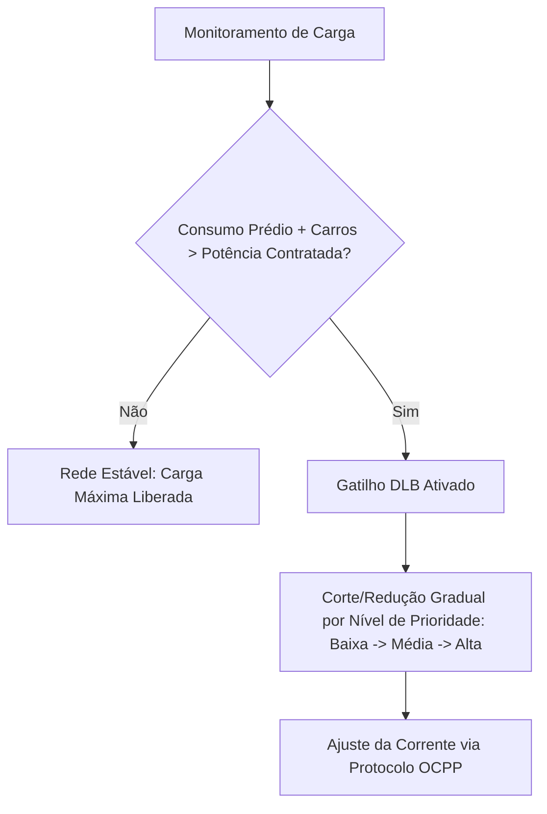

# ChargeGrid Intelligence - Sprint 2 (GoodWe Challenge)

## Integrantes do Grupo
* Lucas Klein - RM: 570029
* Pedro Andreassa - RM: 569318
* Pedro Yoshikado - RM: 570449
* Rafael Ferreirinha - RM: 571949
* Thiago Maluf – RM: 569852

## Descrição da Solução
O **ChargeGrid Intelligence** é uma solução focada no gerenciamento inteligente e otimização de estações de recarga para veículos elétricos (EVs) em ambientes comerciais e frotas corporativas. 

Evoluindo os conceitos teóricos apresentados na Sprint 1, esta entrega traz a **Prova de Conceito (PoC)** funcional desenvolvida em Python. O sistema aplica algoritmos de **Dynamic Load Balancing (DLB)** e simula ações preditivas para evitar a sobrecarga da rede elétrica local, garantindo que o limite de potência contratada do estabelecimento nunca seja ultrapassado, sem a necessidade de investimentos caros em infraestrutura de subestações.

## Arquitetura e Fluxo de Decisão da PoC
A lógica implementada no script Python baseia-se na filtragem em tempo real de três variáveis principais:
1. Consumo flutuante do Prédio Comercial.
2. Geração de energia limpa (Solar Fotovoltaica).
3. Demanda requisitada pelos veículos plugados nas estações.

O sistema intercepta os dados e executa a seguinte tomada de decisão baseada em prioridades de frotas/usuários:



## Como Rodar a Prova de Conceito

Pré-requisitos
  - Python 3.x instalado em sua máquina.
    
Execução
1. Clone o Repositório
```bash
git clone https://github.com/pedroyoshikadogarcia/Fiap-GoodWe-Chargegrid-Sprint2.git
```
2. Localize a Pasta do Projeto e execute a simulação
```bash
python poc_chargegrid.py
```
O console exibirá em tempo real os cenários de simulação do dia, demonstrando o algoritmo atuando para proteger o disjuntor geral da rede e remanejando a potência disponível entre as estações.

